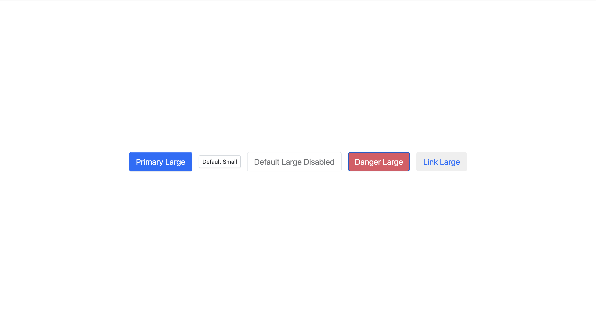
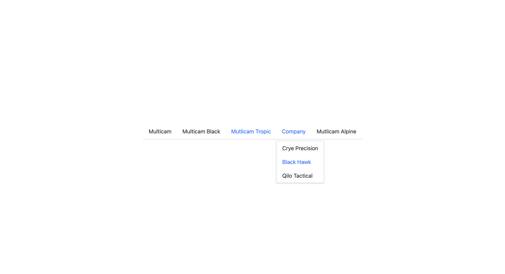
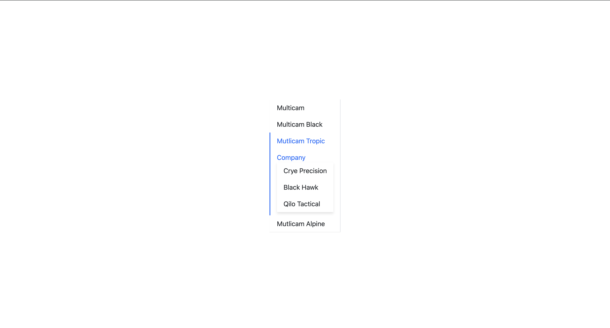

# MontrealComponent

A modern, lightweight, and customizable React component library made and designed in Montreal.

**Currently under active development**

## ✨ Features

- 📦 Collection of reusable **React** components
- 🎨 Written in **TypeScript** with full type support
- 💅 **SCSS** Modules for scoped and maintainable styles
- ⚡ Built with **Vite** for fast development experience
- 🧪 Tested with **Vitest**
- 🏗️ Designed for customization and scalability

## 🛣️ Roadmap

✅ Button component

Different types, sizes, and disabled states of the `Button` component.

✅ Menu component

Horizontal menu and Vertical menu with SubMenu included

🔲 Icon component
🔲 Transition component
🔲 Input component
🔲 Upload component
🔲 Form component

**Happy Hacking TDD 4 life!** 